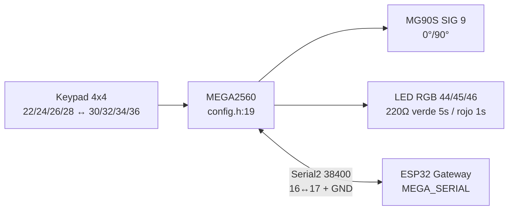
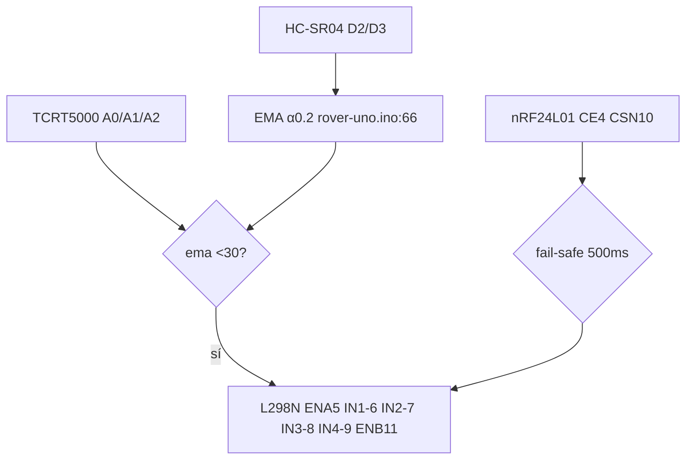
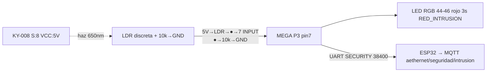
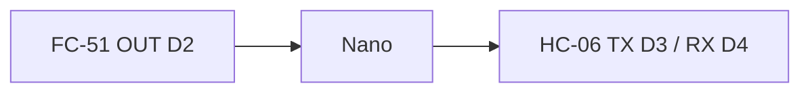

# Compendio de Planos Fritzing — AetherNet IoT & Autonomous Rover

> **Intención:** tener **todos los planos Fritzing por adelantado** — breadboard + schematic — listos para **imprimir en A4** y llevar al **diario de campo**. Cada plano es un `.fzz` independiente (aislado por sprint/subsistema) para no mezclar cableados.
> **Fuente canónica de pines:** `firmware/gateway-esp32/gateway-esp32.ino:60`, `firmware/rover-uno/rover-uno.ino:34`, `firmware/mega-access/src/config.h:17`, `firmware/test-ema-uno/test-ema-uno.ino:11`, `docs/hardware-inventory.md:6`
> **Requisitos trazados:** `docs/requirements.md:20` RF-2.x, RF-3.x, RNF-2.1 + `docs/prd.md:51` KPI EMA 85% + HU-01..04
> **Sprint activo:** Sprint 2 (`docs/sprints.md:52`) — planos P1-P3 son previos/imprimibles hoy; P4-P7 reservados Sprint 3-4 (pre-diseñados para anticipar compras/cableado).
> **Diarios campo:** `docs/Hardware/notebook/Diario_Hardware.ipynb` + `docs/Firmware/notebook/Firmware_Notebook.ipynb` — fritzing aquí es referencia, fotos reales en `docs/Firmware/fotos/` y `docs/Hardware/fotos/`; ver `docs/Firmware/README.md`, `docs/Hardware/README.md`.

---

## 0. Cómo usar este compendio (impresión diaria)

1. **Imprime §1-§3 una sola vez** (portada + convenciones + nomenclatura).
2. **Imprime por día solo el plano que vas a cablear** (§4-§10) — cada uno trae su BoM + netlist + **mapa de conexiones** + checklist.
3. En Fritzing: `File → Open .fzz` → `File → Export → as Image → Breadboard PNG` + `Schematic PNG/PDF` (escala 100%, grosor 0.7mm legible en B/N).
4. Marca el checklist con lápiz y pega la hoja en el diario. Al cierre del banco, commitea foto/scan como `docs/fritzing/<plano>-foto-YYYYMMDD.jpg`.

**Convención de estados en este doc:**
- ✅ `Imprimible HOY` — .fzz existe o es replicable en <15 min con este doc
- 🟡 `Pre-diseñado` — netlist definido, .fzz pendiente (crearlo siguiendo §)
- ⏳ `Reservado Sprint 3-4` — no cablear aún, solo validar BoM

---

## 1. Matriz Hardware → Planos (con nombres Fritzing + PNG)

| Sub-sistema | Hardware (`docs/hardware-inventory.md:6`) | Plano | Archivo Fritzing (.fzz) | PNG Breadboard / Schematic | Estado |
|---|---|---|---|---|---|
| **Gateway Central** | ESP32-WROOM-32U + nRF24L01 #1 | **P2** Enlace RF | `AetherNet-P2-RF-Link-v1.fzz` *(alias legacy `sprint 1.fzz` / `Prueba nRF24L01 DEVOPS-05.fzz`)* | `AetherNet-P2-RF-Link-v1-breadboard.png` / `AetherNet-P2-RF-Link-v1-schematic.png` | ✅ |
| **Control Acceso** | MEGA 2560 + Keypad 4x4 + MG90S + LED RGB 44/45/46 | **P3** Cerrojo | `AetherNet-P3-MEGA-Cerrojo-v1.fzz` *(alias `mega-cerrojo-v1.fzz`)* | `AetherNet-P3-MEGA-Cerrojo-v1-breadboard.png` / `AetherNet-P3-MEGA-Cerrojo-v1-schematic.png` | ✅ |
| **Trampa Láser** | KY-008 TX/RX (7/8 reservados) | **P5** Láser | `AetherNet-P5-Laser-v1.fzz` *(a crear)* | `AetherNet-P5-Laser-v1-breadboard.png` / `AetherNet-P5-Laser-v1-schematic.png` | 🟡 |
| **Rover Tanque** | UNO #1 + L298N + HC-SR04 + 3×TCRT5000 + nRF24L01 #2 + TP4056 + StepUp 5V | **P4** Rover completo | `AetherNet-P4-Rover-v1.fzz` *(alias `rover-completo-v1.fzz`)* | `AetherNet-P4-Rover-v1-breadboard.png` / `AetherNet-P4-Rover-v1-schematic.png` | 🟡 |
| **Banco EMA** | UNO + HC-SR04 (aislado) | **P1** EMA | `AetherNet-P1-EMA-UNO-v1.fzz` *(alias `Filtro EMA.fzz`)* | `AetherNet-P1-EMA-UNO-v1-breadboard.png` / `AetherNet-P1-EMA-UNO-v1-schematic.png` | ✅ |
| **Nodo Ambiental** | ESP8266MOD + KY-037 + Tira LED | **P6** Ambiental | `AetherNet-P6-Ambiental-v1.fzz` *(alias `nodo-ambiental-v1.fzz`)* | `AetherNet-P6-Ambiental-v1-breadboard.png` / `AetherNet-P6-Ambiental-v1-schematic.png` | ⏳ |
| **Nodo Compacto** | Nano + FC-51 + HC-06 | **P7** Compacto | `AetherNet-P7-Compacto-v1.fzz` *(alias `nodo-compacto-v1.fzz`)* | `AetherNet-P7-Compacto-v1-breadboard.png` / `AetherNet-P7-Compacto-v1-schematic.png` | ⏳ |
| **Lab** | 2× UNO #2/#3 + GY-31 + 2× HC-06 + 2× L9110S | — | bancos sueltos | — | — |

Detalles previos existentes: `docs/fritzing/ema-uno-esquematico.md:2`, `docs/fritzing/ema-bench-mapa.md:1`, `docs/fritzing/plano-sprint1-nrf24-reapertura.md:1`, `docs/fritzing/sprint1-mapa.md:1`, `docs/fritzing/mega-cerrojo-pines.md:1`.

---

## 2. Convenciones Fritzing para todo el proyecto

| Elemento | Norma | Por qué |
|---|---|---|
| **Grosor cable** | `0.7 mm` en Inspector | Legible en impresión B/N A4 |
| **Colores** | VCC 5V Rojo, 3.3V Rojo-naranja, GND Negro, SDA/Trigger Verde, SCL/Echo Azul, SPI CE Naranja / CSN Amarillo / SCK Verde / MOSI Azul / MISO Violeta, UART Violeta, PWM Servo Naranja | Mismo código en todos los planos (§4-§10) |
| **Condensadores nRF** | **10µF ideal** (o 22µF válido) ≤5mm VCC-GND + 100nF en paralelo | `docs/fritzing/plano-sprint1-nrf24-reapertura.md:13` — sin cap `radio.begin()` falla |
| **Resistencias LED** | `220Ω` por ánodo (no en cátodo común) | `docs/fritzing/mega-cerrojo-pines.md:56` |
| **Fuente servo** | **5V externa 2A** con GND común, no 5V del MEGA | `docs/fritzing/mega-cerrojo-pines.md:28` |
| **Escala** | Breadboard 100% + Schematic 80% en A4 | Para diario, sin recortar |
| **Etiquetas** | Cada plano lleva `HU-0x / RF-x.x / α=0.2` si aplica | Trazabilidad auditoría |

### 2.1 Nomenclatura AetherNet para Fritzing + PNG (obligatoria)

**Formato:** `AetherNet-P<n>-<Sigla>-v<major>.fzz`

- `P<n>` = número de plano de este compendio (P1-P7).
- `<Sigla>` = subsistema corto (`EMA-UNO`, `RF-Link`, `MEGA-Cerrojo`, `Rover`, `Laser`, `Ambiental`, `Compacto`).
- `v<major>` = versión mayor (v1, v2...). Cambios de pines = nueva versión.

**Regla de exportación (en Fritzing):**
```
File → Save As → docs/fritzing/AetherNet-P<n>-<Sigla>-v1.fzz
File → Export → as Image → Breadboard → docs/fritzing/AetherNet-P<n>-<Sigla>-v1-breadboard.png  (300 DPI, fondo blanco)
File → Export → as Image → Schematic → docs/fritzing/AetherNet-P<n>-<Sigla>-v1-schematic.png
File → Export → as Image → Schematic → docs/fritzing/AetherNet-P<n>-<Sigla>-v1-schematic.pdf  (vector para imprimir)
```
> Si ya existe un `.fzz` legacy (ej. `Filtro EMA.fzz`, `mega-cerrojo-v1.fzz`), **guarda una copia renombrada** con el formato AetherNet y deja el alias en la tabla §1 para no romper links previos.

**Mapa de conexiones = obligatorio en cada plano (§4-§10):** cada sección incluye (a) **Mermaid** (flujo lógico) + (b) **ASCII breadboard map** (vista superior para copiar a Fritzing) + (c) **Netlist tabla** (verificación cable a cable).

---

## 3. BoM Global (compras mínimas para todos los planos)

| # | Componente | Cant total | Usado en | Nota compra |
|---|---|---|---|---|
| 1 | ESP32-WROOM DevKit V1 30p | 1 | P2 | `gateway-esp32` |
| 2 | Arduino MEGA 2560 | 1 | P3,P5 | `mega-access` |
| 3 | Arduino UNO R3 | 3 (1 rover + 2 lab/banco) | P1,P2,P4 | Uno para EMA aislado |
| 4 | ESP8266MOD (NodeMCU) | 1 | P6 | Nodo KY-037 |
| 5 | Arduino Nano | 1 | P7 | FC-51/HC-06 |
| 6 | nRF24L01 2.4GHz | 2 | P2,P4 | Canal 76 2Mbps PA_HIGH `gateway-esp32.ino:129` |
| 7 | HC-SR04 | 1 | P1,P4 | `MAX_DISTANCE_CM 200` `rover-uno.ino:44` |
| 8 | L298N | 1 | P4 | `ENA5 IN1 6 IN2 7 IN3 8 IN4 9 ENB11` `rover-uno.ino:34` |
| 9 | TCRT5000 | 3 | P4 | `A0 A1 A2` `rover-uno.ino:47` |
| 10 | Keypad 4x4 membrana | 1 | P3 | `ROW 30,32,34,36 COL 22,24,26,28` `config.h:19` |
| 11 | Servo MG90S | 1 | P3 | `SERVO_PIN 9` `config.h:23` `0°/90°` |
| 12 | LED RGB cátodo común + 3×220Ω | 1 | P3 | `44/45/46` `config.h:30` PWM |
| 13 | KY-008 Láser TX/RX | 1 kit | P5 | `7/8 reservados` `config.h:37` |
| 14 | KY-037 Micrófono (AO) | 1 | P6 | `AO→A0 ESP8266` `RNF-2.1` |
| 15 | Tira LED 5V + MOSFET / WS2812 | 1 | P6 | Ambiental reactiva |
| 16 | FC-51 IR + HC-06 | 1 c/u | P7 | Nano D2/D3 soft serial |
| 17 | GY-31 + L9110S | 1/2 | Lab | Calibración color |
| 18 | Cond. 10µF electrolítico | 4 | P2,P4 | **Ideal nRF** (tienes 4×10µF) |
| 19 | Cond. 22µF electrolítico | 2 | reserva nRF | Válido si faltan 10µF |
| 20 | Cond. 100nF cerámico | 2-4 | P2,P4 | Paralelo HF |
| 21 | Cond. 47µF/100µF | 2/3 | P4 | Bulk L298N/TP4056 (NO nRF) |
| 22 | TP4056 + StepUp 5V + 18650 | 1 | P4 | Rover batería |
| 23 | AMS1117-3.3 regulador | 1 | P2 | Backup si 3.3V UNO ruidoso |
| 24 | Breadboards half-size | 4 | todos | Uno por subsistema |
| 25 | Dupont M-H/M-M + USB A/B/C | 40+ | todos | + cables UART |

> **Compra crítica antes de Sprint 3:** L298N, TCRT5000×3, KY-008, KY-037 si no están en inventario. Resto ya validado Sprint 1.

---

## 4. P1 — Banco EMA Solo UNO (HU-03 / RNF-2.1, KPI >85%)

**Objetivo:** visualizar `raw` vs `EMA α=0.2` estable sin RF/MQTT.

**Archivos del plano:**
- Fritzing: `docs/fritzing/AetherNet-P1-EMA-UNO-v1.fzz` *(alias legacy `Filtro EMA.fzz`)*
- PNG Breadboard: `docs/fritzing/AetherNet-P1-EMA-UNO-v1-breadboard.png`
- PNG Schematic: `docs/fritzing/AetherNet-P1-EMA-UNO-v1-schematic.png` + PDF idem
- Spec previa: `docs/fritzing/ema-uno-esquematico.md:2`

### Mapa de conexiones P1

**Mermaid (flujo de señal):**
```mermaid
graph LR
  HC[HC-SR04<br/>ping_cm D2/D3] --> RAW[raw ruidoso ±8cm]
  RAW --> EMA[EMA α=0.2<br/>S_t=α·Y_t+(1-α)·S_t-1]
  EMA --> SER[Serial 115200<br/>raw,ema 20Hz]
  SER --> PLOT[Serial Plotter<br/>raw rojo / ema azul]
  PLOT --> DEC{ema < 30?}
  DEC -->|rover.ino:322| GIRO
```

**ASCII Breadboard (vista superior, para copiar a Fritzing):**
```
 [PC USB 115200] ──USB── [Arduino UNO]
                            5V ●───── Rojo ─────● VCC HC-SR04
                           GND ●───── Negro ─────● GND HC-SR04
                            D2 ●───── Verde ─────● TRIG HC-SR04
                            D3 ●───── Azul ──────● ECHO HC-SR04
                                                        
                         ┌──────── Breadboard ────────┐
                         │  HC-SR04 transductores →   │
                         │  borde protoboard          │
                         └────────────────────────────┘
```

**Netlist P1 (verificación cable a cable):**

| HC-SR04 Pin | → | UNO Pin | Color | Origen |
|---|---|---|---|---|
| VCC | → | 5V | Rojo | `test-ema-uno.ino:34` |
| GND | → | GND | Negro | — |
| TRIG | → | D2 | Verde | `test-ema-uno.ino:11` `ULTRASONIC_TRIG 2` |
| ECHO | → | D3 | Azul | `test-ema-uno.ino:12` `ULTRASONIC_ECHO 3` |
| USB | → | PC | — | `115200 baud` `test-ema-uno.ino:23` `raw,ema` |

**Instrucciones Fritzing P1:**
1. Nuevo: `File → New` → `File → Save As → AetherNet-P1-EMA-UNO-v1.fzz`.
2. Breadboard: UNO centro USB izq, HC-SR04 arriba en breadboard transductores afuera.
3. Cablea netlist con grosor 0.7mm, colores indicados.
4. Schematic: bus 5V/GND compartido, D2/D3 sin junctions fantasma. Añade etiqueta `P1 EMA α=0.2 HU-03`.
5. Export: `AetherNet-P1-EMA-UNO-v1-breadboard.png` + `AetherNet-P1-EMA-UNO-v1-schematic.png/PDF`.

**Firmware:** `firmware/test-ema-uno/test-ema-uno.ino:14` `EMA_ALPHA 0.2f` `test-ema-uno.ino:42` `ema=0.2*raw+0.8*ema` 20Hz `test-ema-uno.ino:46` (`stats/ema_filter.py:17` idéntico).
**Prueba:** `arduino-cli upload -p /dev/ttyACM0 --fqbn arduino:avr:uno ./firmware/test-ema-uno` + `Tools → Serial Plotter 115200` → raw rojo / ema azul `docs/fritzing/ema-uno-esquematico.md:99`.

**Checklist impresión P1:**
- [ ] `AetherNet-P1-EMA-UNO-v1-breadboard.png` + `AetherNet-P1-EMA-UNO-v1-schematic.png` impresos A4 100%
- [ ] HC-SR04 5V (no 3.3V) — ECHO 5V OK en UNO, divisor si fuera ESP32
- [ ] `raw,ema` header visible en Plotter
- [ ] Rampa 100→20 cm: ema retrasa 3-4 muestras sin falsos `30cm`

**Diario:** pega ambos PNG + dibuja traza raw vs ema + anota `noise_reduction 89.3%` (`stats/data/ema_demo.json`).

---

## 5. P2 — Enlace RF nRF24L01 ESP32 ↔ UNO (DEVOPS-05 / RF-2.1, RF-3.1, RF-3.3)

**Objetivo:** validar `radio.begin()` + round-trip + fail-safe 500ms + latencia <10ms.

**Archivos del plano:**
- Fritzing: `docs/fritzing/AetherNet-P2-RF-Link-v1.fzz` *(alias legacy `Prueba nRF24L01 DEVOPS-05.fzz` / `sprint 1.fzz`)*
- PNG Breadboard: `docs/fritzing/AetherNet-P2-RF-Link-v1-breadboard.png`
- PNG Schematic: `docs/fritzing/AetherNet-P2-RF-Link-v1-schematic.png`
- Spec: `docs/fritzing/plano-sprint1-nrf24-reapertura.md:1` + `docs/fritzing/sprint1-mapa.md:1`

### Mapa de conexiones P2

**Mermaid (enlace RF + reserva UART):**
```mermaid
graph TB
  subgraph P2 [P2 RF-Link — DEVOPS-05]
    ESP32[ESP32 Gateway<br/>CE5 CSN15 SCK18 MOSI23 MISO19]
    RF1[nRF24L01 #1<br/>C76 2Mbps PA_HIGH +10µF]
    UNO[Arduino UNO Rover<br/>CE4 CSN10 SCK13 MOSI11 MISO12]
    RF2[nRF24L01 #2<br/>+10µF FAIL-SAFE 500ms]
    ESP32 ---|SPI HSPI| RF1
    UNO ---|SPI HW| RF2
    RF1 <-->|RF 2.4GHz<br/>RoverCommand 7B {L,R,mode,chk}| RF2
  end
  MEGA[(MEGA2560 P3<br/>Sprint 2)] -.->|UART 38400<br/>TX17↔RX16 NO CONECTAR en P2| ESP32
  style MEGA stroke-dasharray:6 4,fill:#eee
  style RF1 fill:#d0ebff
  style RF2 fill:#d0ebff
```

**ASCII Breadboard (dos nodos separados):**
```
NODO A — Gateway                    NODO B — Rover
[ESP32 DevKit V1]                   [Arduino UNO]
 3V3 ●─Rojo─┬─● VCC RF1                3.3V ●─Rojo─┬─● VCC RF2
 GND ●─Negro┼─● GND RF1 +C1 10µF       GND ●─Negro┼─● GND RF2 +C2 10µF
  5 ●Naranja─┼─● CE  RF1                 D4 ●Naran─┼─● CE  RF2
 15 ●Amarillo┼─● CSN RF1(*)              D10●Amar─┼─● CSN RF2
 18 ●Verde───┼─● SCK RF1                 D13●Verde─┼─● SCK RF2
 23 ●Azul────┼─● MOSI RF1                D11●Azul──┼─● MOSI RF2
 19 ●Violeta─┼─● MISO RF1                D12●Viol──┼─● MISO RF2
 USB ──115200                          USB ──115200
 (*) CSN15 corrige colisión 18 (gateway-esp32.ino:61)
              ↕ RF 2.4GHz Canal 76 (GATEW/ROVER)
```

**BoM P2:**
| # | Parte | Nota |
|---|---|---|
| RF1/RF2 | nRF24L01 ×2 | C76 2Mbps PA_HIGH `gateway-esp32.ino:129` `rover-uno.ino:140` |
| C1/C2 | 10µF ideal (o 22µF válido) | ≤5mm VCC-GND + 100nF `plano-sprint1-nrf24-reapertura.md:13` |
| BB1/BB2 | Breadboard ×2 | No compartir 3.3V |

**Netlist P2.1 Gateway ESP32 ↔ nRF #1 (HSPI):**

| nRF #1 | → | ESP32 | Color | Origen |
|---|---|---|---|---|
| VCC | → | 3V3 | Rojo | +C1 |
| GND | → | GND | Negro | — |
| CE | → | GPIO5 | Naranja | `gateway-esp32.ino:60` `NRF_CE_PIN 5` |
| CSN | → | GPIO15* | Amarillo | `gateway-esp32.ino:61` `NRF_CSN_PIN 15` (*no 18, corrige colisión SCK**) |
| SCK | → | GPIO18 | Verde | SPI HW |
| MOSI | → | GPIO23 | Azul | — |
| MISO | → | GPIO19 | Violeta | — |

**Netlist P2.2 Rover UNO ↔ nRF #2 (SPI HW):**

| nRF #2 | → | UNO | Color | Origen |
|---|---|---|---|---|
| VCC | → | 3.3V | Rojo | +C2 |
| GND | → | GND | Negro | — |
| CE | → | D4 | Naranja | `rover-uno.ino:53` `CE4` |
| CSN | → | D10 | Amarillo | `rover-uno.ino:54` `CSN10` (free tras ENB→11 `rover-uno.ino:39`) |
| SCK | → | D13 | Verde | SPI HW |
| MOSI | → | D11 | Azul | — |
| MISO | → | D12 | Violeta | — |

**Reservado Sprint 2 (punteado, NO cablear en P2):** UART ESP32 `TX17→MEGA RX16` / `RX16←MEGA TX17` `38400` `gateway-esp32.ino:64` `config.h:41`.

**Instrucciones Fritzing P2:**
1. `File → Save As → AetherNet-P2-RF-Link-v1.fzz`.
2. Breadboard: ESP32 arriba USB izq, UNO abajo, 2 mini breadboard con nRF + cap pegado ≤5mm.
3. Cablea tablas con colores, 0.7mm. Schematic: bus SPI sin junctions, label `P2 RF-Link (*) CSN15`.
4. Export: `AetherNet-P2-RF-Link-v1-breadboard.png` + `AetherNet-P2-RF-Link-v1-schematic.png/PDF`.

**Checklist cierre Sprint 1 (`docs/fritzing/plano-sprint1-nrf24-reapertura.md:96`):**
- [ ] PNGs `AetherNet-P2-RF-Link-v1-*` impresos y pegados en diario
- [ ] `NRF_CSN_PIN 15` corregido (no 18)
- [ ] `nRF24L01 initialized` ambos lados 115200
- [ ] `mosquitto_pub` → `RF TX: L=120 R=120 mode=1` `gateway-esp32.ino:261` → `RF RX` `rover-uno.ino:202`
- [ ] FAIL-SAFE <500ms `rover-uno.ino:220` `FAILSAFE_TIMEOUT_MS 500`
- [ ] Latencia <10ms `docs/prd.md:50`

---

## 6. P3 — MEGA Cerrojo + LED RGB + UART (RF-2.2 / HU-01)

**Objetivo:** control PIN → servo + LED verde 5s + evento UART.

**Archivos del plano:**
- Fritzing: `docs/fritzing/AetherNet-P3-MEGA-Cerrojo-v1.fzz` *(alias `mega-cerrojo-v1.fzz`)*
- PNG Breadboard: `docs/fritzing/AetherNet-P3-MEGA-Cerrojo-v1-breadboard.png`
- PNG Schematic: `docs/fritzing/AetherNet-P3-MEGA-Cerrojo-v1-schematic.png`
- SVG ref: `docs/fritzing/mega-cerrojo-wiring.svg`
- Spec: `docs/fritzing/mega-cerrojo-pines.md:1`

### Mapa de conexiones P3

**Mermaid (cerrojo):**


**ASCII Breadboard (MEGA central):**
```
┌────────────────── ARDUINO MEGA 2560 ──────────────────┐
│  Keypad abajo-izq (8 dupont)                          │
│   30 ●─Gris─→ R1? no, según config.h:19               │
│   COL 22,24,26,28 ●─Gris──→ Keypad R1-R4               │
│   ROW 30,32,34,36 ●─Amarillo→ Keypad C1-C4              │
│                                                       │
│   44 ●─Rojo─220Ω─→ LED R ─┐                            │
│   45 ●─Verde─220Ω→ LED G ─┤→ cátodo ●─Negro─→ GND      │
│   46 ●─Azul─220Ω─→ LED B ─┘  (ánodo común 255-valor)   │
│                                                       │
│    9 ●─Naranja──→ Servo SIG                           │
│   5V EXT ●─Rojo─→ Servo VCC (fuente ext 2A)           │
│  GND ●─Marrón──→ Servo GND (GND común)                │
│                                                       │
│   16 ●←Violeta── ESP32 17 (TX)                        │
│   17 ●─Violeta→ ESP32 16 (RX) + GND●─Negro─↔ GND ESP32│
│   7,8 ○ vacío “KY-008 → P5”                           │
└───────────────────────────────────────────────────────┘
```

**Netlist P3 (copia literal):**

| Función | Pin MEGA | Dir | Cable | Parte Fritzing |
|---|---|---|---|---|
| Row0-3 | 30,32,34,36 → 22,24,26,28* | IN/OUT | Gris / Amarillo | Keypad 4x4 (`config.h:19` transpose fix 2026-08-26) |
| Servo SIG | 9 PWM | OUT | Naranja | MG90S `config.h:23` `0°/90°` |
| Servo VCC/GND | 5V EXT / GND | PWR | Rojo/Marrón | Fuente externa 2A, GND común |
| LED R/G/B | 44/45/46 PWM | OUT | Rojo/Verde/Azul via 220Ω | RGB ánodo común `config.h:30` `LED_COMMON_ANODE` invertido (255-valor) |
| LED cátodo | GND | — | Negro | — |
| UART RX2/TX2 | 16 / 17 | IN/OUT | Violeta cruzado | ESP32 17→16 / 16→17 `config.h:41` `38400` + GND común |
| Keypad `*` borra, `#` envía, `A-D` ignora | — | — | — | `mega-access.ino:33` |

* Ver `config.h:19` `ROW_PINS {30,32,34,36} COL_PINS {22,24,26,28}` — inverso físico documentado.

**Instrucciones Fritzing P3:**
1. `File → Save As → AetherNet-P3-MEGA-Cerrojo-v1.fzz`.
2. MEGA centro, keypad abajo-izq 8 dupont, servo der SIG→9 + rail EXT 5V, protoboard LED +3×220Ω →44/45/46, UART 16↔17 + GND.
3. Deja 7/8 vacío con nota “KY-008 → P5”.
4. Schematic: MEGA MCU + matriz pulsadores + servo 3p + LED 3 resistencias + ESP32 bloque UART. Labels: `VALID_PIN 1234` `DOOR_AUTO_LOCK_MS 5000` `verde 5s / rojo 1s fallo / azul 50ms dígito`.
5. Export: `AetherNet-P3-MEGA-Cerrojo-v1-breadboard.png` + `AetherNet-P3-MEGA-Cerrojo-v1-schematic.png/PDF`.

**Checklist P3:**
- [ ] PNGs `AetherNet-P3-MEGA-Cerrojo-v1-*` impresos
- [ ] Sin Relay Module
- [ ] 44/45/46 solo LED + 220Ω visibles
- [ ] 9 solo servo, VCC EXT no MEGA 5V
- [ ] 16/17 cruzados + GND común
- [ ] `arduino-cli compile --fqbn arduino:avr:mega` verde

---

## 7. P4 — Rover Completo (RF-3.1/3.2/3.3 / HU-03 HU-04)

**Objetivo:** rover autónomo/evitar obstáculos + anti-caída + fail-safe.

**Archivos del plano:**
- Fritzing: `docs/fritzing/AetherNet-P4-Rover-v1.fzz` *(alias `rover-completo-v1.fzz`)*
- PNG Breadboard: `docs/fritzing/AetherNet-P4-Rover-v1-breadboard.png`
- PNG Schematic: `docs/fritzing/AetherNet-P4-Rover-v1-schematic.png`

### Mapa de conexiones P4

**Mermaid (rover):**


**ASCII Breadboard (UNO + shields):**
```
         [HC-SR04 central D2/D3]
              │
 [L298N]  [Arduino UNO]  [RF2 nRF24L01 CE4 CSN10]
 ENA5 ●── 5  D13●─SCK RF2
 IN1 6●── 6   D12●─MISO
 IN2 7●── 7   D11●─MOSI (+C2 10µF)
 IN3 8●── 8   D10●─CSN
 IN4 9●── 9    D4●─CE
 ENB11●──11   D3●─ECHO
             D2●─TRIG
          A0●─ TCRT L
          A1●─ TCRT C   [Batería 18650 → TP4056 → StepUp 5V → 5V UNO]
          A2●─ TCRT R   [L298N 12V externo, GND común]
          GND común a todos
```

**Netlist P4 (extiende P2.2 + P1):**

| Función | Pin UNO | Dir | Origen |
|---|---|---|---|
| L298N ENA | 5 PWM | OUT | `rover-uno.ino:34` `MOTOR_ENA 5` |
| IN1/IN2 | 6 / 7 | OUT | `rover-uno.ino:35` |
| IN3/IN4 | 8 / 9 | OUT | `rover-uno.ino:37` |
| ENB | 11 PWM | OUT | `rover-uno.ino:39` (movido de 10) |
| HC-SR04 TRIG/ECHO | 2 / 3 | OUT/IN | `rover-uno.ino:42` `MAX_DISTANCE 200` |
| TCRT5000 L/C/R | A0 / A1 / A2 | IN | `rover-uno.ino:47` `IR_THRESHOLD 500` |
| nRF24L01 | Ver P2.2 | — | CE4 CSN10 (P2.2) |
| EMA | `ultrasonicEma α0.2` | — | `rover-uno.ino:66` `251` `readSensors:259` |
| Power | TP4056→StepUp 5V→5V UNO + L298N 12V | — | `docs/hardware-inventory.md:10` |

**Instrucciones Fritzing P4:**
1. `File → Save As → AetherNet-P4-Rover-v1.fzz`.
2. Duplica P1+P2.2, añade L298N arriba UNO (ENA5 IN1-4 6-9 ENB11), 3×TCRT5000 en protoboard frontal A0-A2, HC-SR04 central D2/D3, batería + TP4056 + StepUp lateral con switch.
3. L298N VCC 9-12V externo, GND común con UNO. Jumpers ENA/ENB quitados (PWM).
4. Schematic: UNO + L298N puente H + NewPing + IR analógico + RF SPI. Label `P4 Rover α0.2 30/15cm`.
5. Export: `AetherNet-P4-Rover-v1-breadboard.png` + `AetherNet-P4-Rover-v1-schematic.png/PDF`.

**Lógica:** `readSensors:251` EMA → `executeAutoMode:322` `if ema<30 giro else avance` + `checkFailsafe:214` `500ms stopMotors` `docs/requirements.md:27` RF-3.3 HU-04.

**Checklist P4:**
- [ ] PNGs `AetherNet-P4-Rover-v1-*` impresos
- [ ] ENB 11 no 10 (libre CSN10)
- [ ] HC-SR04 5V, TCRT5000 5V/GND + A0-A2
- [ ] L298N 12V externo, GND común
- [ ] `ultrasonicEma` telemetría `buildTelemetry:239`
- [ ] Fail-safe RF <500ms probado

---

## 8. P5 — Trampa Láser KY-008 (RF-2.3 / HU-02)

**Objetivo:** intrusión → Telegram + LED rojo.

**Archivos del plano:**
- Fritzing: `docs/fritzing/AetherNet-P5-Laser-v1.fzz` *(extiende P3)*
- PNG Breadboard: `docs/fritzing/AetherNet-P5-Laser-v1-breadboard.png`
- PNG Schematic: `docs/fritzing/AetherNet-P5-Laser-v1-schematic.png`

### Mapa de conexiones P5

**Mermaid — LDR discreta:**


**ASCII (sobre P3) — LDR discreta + 10k fija:**
```
P3 MEGA (igual) + añadido P5 discreto:
  8 ●─→ KY-008 (VCC→5V GND→GND S→8) haz ─ ─ ─ → [LDR]
  5V ●─→ LDR pata1
  LDR pata2 ●─┬─→ 7 (MEGA INPUT, sin PULLUP)
              └─→ 10kΩ → GND
  Haz intacto: LDR ~5k → V=3.3V → 7=HIGH | Corte: LDR ~500k → 0.1V → 7=LOW → SECURITY
```

**Netlist P5 (sobre P3, pines reservados):**

| KY-008 | → | MEGA | Color | Nota |
|---|---|---|---|---|
| VCC | → | 5V | Rojo | — |
| GND | → | GND | Negro | — |
| TX (Laser) | → | 8 | Naranja | `config.h:66` `LASER_TX_PIN 8` HIGH=ON (KY-008 VCC→5V GND→GND S→8) |
| LDR pata 1 | → | 5V | Rojo | LDR discreta pata 1 a 5V (ver Fritzing: LDR + 10k divisor) |
| LDR pata 2 ● | → | 7 + 10k→GND | Amarillo/Negro | Nodo ●→7 `INPUT` sin pullup `laser.cpp:15` (HIGH=haz ~3.3V, LOW=corte ~0.1V) Resistencia fija 10kΩ a GND |
| LED ROJO | → | 44-46 | — | `LED ROJO 3s` en intrusión `laser.cpp:46` `RED_INTRUSION` (P5 Mermaid 1s → impl 3s + cooldown) |

> Sprint 2 P3 deja 7/8 vacíos. P5 los cablea. En Fritzing: añade láser arriba puerta + LDR opuesta, línea punteada haz.

**Instrucciones Fritzing P5:** `File → Save As → AetherNet-P5-Laser-v1.fzz` (duplica P3) → añade KY-008 + LDR en protoboard puerta, cablea 7/8, etiqueta `feature/firmware-mega-laser`. Export `AetherNet-P5-Laser-v1-breadboard.png` + `AetherNet-P5-Laser-v1-schematic.png/PDF`.

**Checklist P5:**
- [ ] PNGs `AetherNet-P5-Laser-v1-*` impresos
- [ ] Haz alineado, sin rebote luz
- [ ] `SECURITY:{"event_type":"intrusion"}` UART → `gateway-esp32:325` → MQTT `aethernet/seguridad/intrusion`
- [ ] Falsos 0% `docs/prd.md:52`

---

## 9. P6 — Nodo Ambiental ESP8266 + KY-037 + Tira LED (RNF-2.1 / RF-4.1)

**Objetivo:** sonido ambiente → EMA → MQTT `aethernet/env/sound`.

**Archivos del plano:**
- Fritzing: `docs/fritzing/AetherNet-P6-Ambiental-v1.fzz` *(alias `nodo-ambiental-v1.fzz`)*
- PNG Breadboard: `docs/fritzing/AetherNet-P6-Ambiental-v1-breadboard.png`
- PNG Schematic: `docs/fritzing/AetherNet-P6-Ambiental-v1-schematic.png`

### Mapa de conexiones P6

**Mermaid:**
```mermaid
graph LR
  MIC[KY-037 AO A0] --> EMA[EMA α0.2 + abs(desv)]
  EMA --> ESP[ESP8266 NodeMCU]
  ESP --> LED[Tira LED D6 MOSFET]
  ESP -->|MQTT| BROKER[aethernet/env/sound]
```

**ASCII:**
```
[NodeMCU ESP8266]
 5V ●─Rojo─┬─● VCC KY-037
GND ●─Negro┼─● GND KY-037
 A0 ●─Azul─┼─● AO  KY-037 (si 5V → divisor 2:1)
 D5 ●─Verde┼─● DO  KY-037 (opcional umbral)
 D6 ●──────┼─● MOSFET → Tira LED 5V
 USB ──5V
```

| KY-037 / LED | → | ESP8266 | Color | Nota |
|---|---|---|---|---|
| KY-037 VCC/GND | → | 5V/GND | Rojo/Negro | — |
| KY-037 AO | → | A0 | Azul | Analógico 0-1023, EMA α0.2 `docs/Estadistica/roadmap-estadistica.md:51` (requiere `abs(desv-baseline)` previo, decidir en EST-11) |
| KY-037 DO | → | D5 (opcional) | Verde | Umbral pot |
| Tira LED 5V | → | D6 via MOSFET | — | `docs/hardware-inventory.md:11` reactiva |
| Power | → | USB 5V | — | — |

**Instrucciones Fritzing P6:** `File → Save As → AetherNet-P6-Ambiental-v1.fzz` — NodeMCU centro, KY-037 izq AO→A0, tira LED der D6 + MOSFET + fuente 5V externa, breadboard. Export `AetherNet-P6-Ambiental-v1-breadboard.png` + `AetherNet-P6-Ambiental-v1-schematic.png/PDF`. Nota: `P6 es Sprint 4 EST-11 EST-02`; no probar EMA sin captura 60s silencio+palmada `docs/Estadistica/backlog-estadistica.md:54`.

**Checklist P6:**
- [ ] PNGs `AetherNet-P6-Ambiental-v1-*` impresos
- [ ] AO→A0 sin divisor (ESP8266 A0 tolera 0-3.3V; si KY-037 AO 5V, usar divisor 2:1)
- [ ] `EST-11 histograma` antes de firmware KY-037
- [ ] MQTT `aethernet/env/sound` publicado

---

## 10. P7 — Nodo Acceso Compacto Nano + FC-51 + HC-06 (RF-1.3 fallback)

**Objetivo:** presencia + BT SPP fallback.

**Archivos del plano:**
- Fritzing: `docs/fritzing/AetherNet-P7-Compacto-v1.fzz` *(alias `nodo-compacto-v1.fzz`)*
- PNG Breadboard: `docs/fritzing/AetherNet-P7-Compacto-v1-breadboard.png`
- PNG Schematic: `docs/fritzing/AetherNet-P7-Compacto-v1-schematic.png`

### Mapa de conexiones P7

**Mermaid:**


**ASCII:**
```
[Nano]
 5V ●─┬─● VCC FC-51
GND ●─┼─● GND FC-51
 D2 ●─┼─● OUT FC-51
 5V ●─┼─● VCC HC-06
GND ●─┼─● GND HC-06
 D3 ●─┼─● TX HC-06 (Nano RX)
 D4 ●─┼─● RX HC-06 (divisor 1k/2k si 5V)
```

| Componente | → | Nano | Color | Nota |
|---|---|---|---|---|
| FC-51 VCC/GND/OUT | → | 5V/GND/D2 | — | IR presencia `docs/hardware-inventory.md:12` |
| HC-06 VCC/GND | → | 5V/GND | — | BT SPP |
| HC-06 TX/RX | → | D3/D4 (SW Serial) | — | Cruzado + divisor 5→3.3 si RX HC-06 |
| Power | → | USB | — | — |

**Instrucciones Fritzing P7:** `File → Save As → AetherNet-P7-Compacto-v1.fzz` — Nano centro, FC-51 frontal OUT→D2, HC-06 lateral TX→D3 RX←D4, protoboard mini. Export `AetherNet-P7-Compacto-v1-breadboard.png` + `AetherNet-P7-Compacto-v1-schematic.png/PDF`.

**Checklist P7:**
- [ ] PNGs `AetherNet-P7-Compacto-v1-*` impresos
- [ ] FC-51 pot calibrado sin falsos luz ambiente
- [ ] HC-06 pareado `AetherControl` `MOV-07` fallback `docs/backlog.md:24`

---

## 11. Componentes Adicionales & Consumibles (para diario)

- **Capacitores:** 10µF ideal nRF (obligatorio), 22µF válido backup, 100nF HF, 47/100µF bulk L298N, electrolíticos polaridad marcada.
- **Resistencias:** 220Ω LED (3×), 1k/2k divisor UART MEGA 5V TX → ESP32 3.3V RX (`gateway-esp32.ino:63` `GATEWAY_BAUD 38400` estable con divisor), 10k pot TCRT/KY-037.
- **Reguladores:** AMS1117-3.3 backup nRF, StepUp 5V rover, TP4056 carga 18650.
- **Cableado:** Dupont M-H 20cm (SPI), M-M breadboard, USB A-B (UNO/MEGA), USB-C (ESP32), GND común imprescindible.
- **Impresión:** A4 100dpi, B/N con colores anotados a mano si impresora B/N; plastificar 1 copia para campo.

---

## 12. Checklist Maestra de Impresión (marca antes de salir a campo)

- [ ] `AetherNet-P1-EMA-UNO-v1-breadboard.png` + `AetherNet-P1-EMA-UNO-v1-schematic.png` impresos A4 100% (P1)
- [ ] `AetherNet-P2-RF-Link-v1-breadboard.png` + `AetherNet-P2-RF-Link-v1-schematic.png` impresos + caps 10µF a mano (P2)
- [ ] `AetherNet-P3-MEGA-Cerrojo-v1-breadboard.png` + `AetherNet-P3-MEGA-Cerrojo-v1-schematic.png` impresos + 3×220Ω + fuente servo EXT (P3)
- [ ] `AetherNet-P4-Rover-v1-*`, `AetherNet-P5-Laser-v1-*`, `AetherNet-P6-Ambiental-v1-*`, `AetherNet-P7-Compacto-v1-*` pre-diseñados (netlist en mano, sin cablear si es Sprint 2)
- [ ] Diario con hojas en blanco para anotar `raw vs ema`, `radio.begin()`, `FAIL-SAFE`, `PIN 1234`, `GND común`
- [ ] `arduino-cli` + cables USB probados hoy en PC campo

---

## 13. Export & Versionado (.fzz → PNG/PDF)

- Guarda cada plano como `docs/fritzing/AetherNet-P<n>-<Sigla>-v1.fzz` + `File → Export → Breadboard PNG (300 DPI)` + `Schematic PNG + PDF` con **exactamente el mismo prefijo** (§2.1).
- Ejemplo P1: `AetherNet-P1-EMA-UNO-v1.fzz` → `AetherNet-P1-EMA-UNO-v1-breadboard.png` + `AetherNet-P1-EMA-UNO-v1-schematic.png` + `AetherNet-P1-EMA-UNO-v1-schematic.pdf`.
- Commitea con mensaje `docs(fritzing): P<#> HU-XX RF-X.X plano v1`.
- CI `arduino-cli compile` debe seguir verde (`RNF-1.2` `docs/requirements.md:40`) — no afecta, solo docs.

---

## 14. Trazabilidad Rápida (para evaluador UTP)

| Plano | RF/HU/KPI | FW origen | Sprint | Fritzing | PNGs |
|---|---|---|---|---|---|
| P1 | HU-03 RNF-2.1 EMA α0.2 KPI 85% | `test-ema-uno.ino:11` `ema_filter.py:17` | 1-2 | `AetherNet-P1-EMA-UNO-v1.fzz` | `*-breadboard.png` `*-schematic.png` |
| P2 | RF-2.1 RF-3.1 RF-3.3 Lat <10ms Fail-safe 500ms | `gateway-esp32.ino:60` `rover-uno.ino:53` | 1 | `AetherNet-P2-RF-Link-v1.fzz` | idem |
| P3 | RF-2.2 HU-01 PIN 1234 LED 5s | `mega-access/src/config.h:19` | 2 | `AetherNet-P3-MEGA-Cerrojo-v1.fzz` | idem |
| P4 | RF-3.2 HU-03 HU-04 | `rover-uno.ino:34` `66` `214` | 3 | `AetherNet-P4-Rover-v1.fzz` | idem |
| P5 | RF-2.3 HU-02 Láser 0% falsos | `config.h:37` `gateway:325` | 4 | `AetherNet-P5-Laser-v1.fzz` | idem |
| P6 | RNF-2.1 KY-037 RNF-2.2 | `roadmap-estadistica.md:51` | 4 | `AetherNet-P6-Ambiental-v1.fzz` | idem |
| P7 | RF-1.3 BT SPP | `backlog.md:24` MOV-07 | 3 | `AetherNet-P7-Compacto-v1.fzz` | idem |

> **Recomendación campo:** empieza siempre por P1 (EMA) y P2 (RF) — son los únicos que validan KPI y latencia (`docs/prd.md:50`). Con esos dos verdes, el resto es incremental y tu diario tendrá evidencia reproducible desde Sprint 2.

