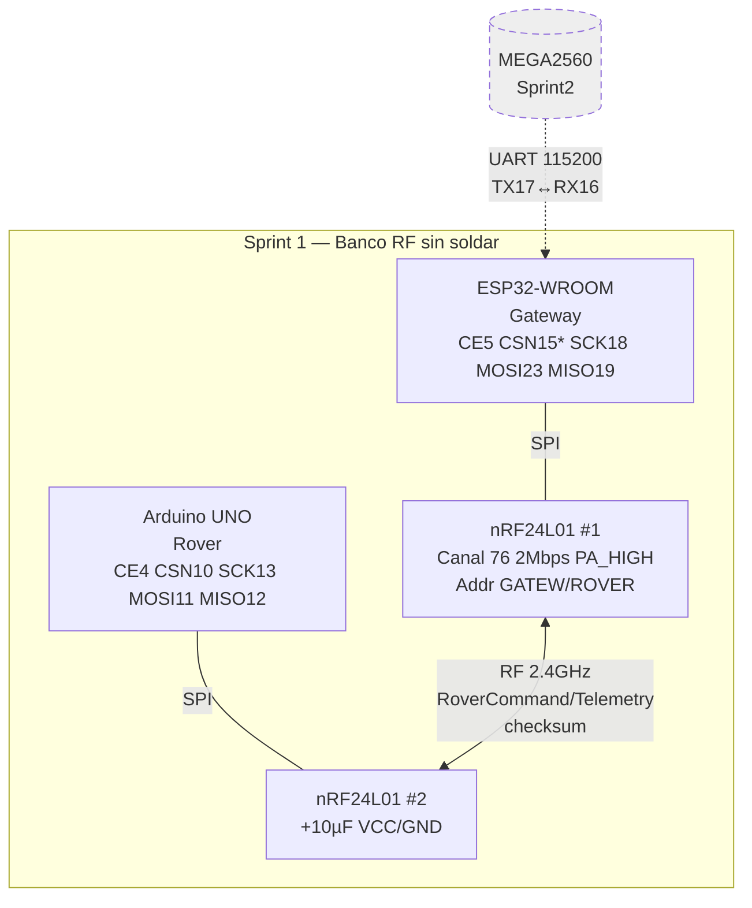

# Mapa Fritzing — Sprint 1: Enlace RF nRF24L01 ESP32 ↔ UNO (DEVOPS-05)

> **Aislado Sprint 1** — Rama `feature/stats-ema-prototipo` (`566932c`). Solo lo necesario para validar `RF-2.1` base y `RF-3.1/3.3` sin arrastrar MEGA/LED/servo de Sprint 2 ni rover de Sprint 3. Todo lo de Sprint 2+ va en línea punteada y no se cablea en este .fzz.
>
> Referencias fuente: `firmware/gateway-esp32/src/gateway.ino:30`, `firmware/rover-uno/src/rover.ino:53`, `firmware/README.md:68`, `docs/testing-rf-sprint1.md:8`, `docs/architecture.md:63`, `docs/hardware-inventory.md:6`

---

## 1. Objetivo del esquema

Validar en banco (sin soldar) que `radio.begin()` pasa en ambos lados y que un `RoverCommand` (`firmware/README.md:102`) hace round-trip con latencia `<10 ms` y fail-safe `<500 ms` (`docs/testing-rf-sprint1.md:33`). Si esto no está verde, ningún sprint posterior debe avanzar (`docs/sprints.md:15`).

## 2. BoM Sprint 1 (solo Fritzing)

| # | Parte Fritzing | Ref. | Notas |
|---|---|---|---|
| 1 | ESP32 DevKit V1 (30-pin) | U1 Gateway | En Fritzing busca `ESP32` → `ESP32 DevKit V1`. El doc usa ESP32-WROOM-32U, mismo pinout. |
| 2 | Arduino UNO R3 | U2 Rover | `Arduino UNO (Rev3)` |
| 3 | nRF24L01 (2.4GHz) ×2 | RF1, RF2 | Parte `nRF24L01` en core. Ojo: Fritzing lo muestra con 8 pines, usar vista PCB. |
| 4 | Condensador electrolítico 10µF ×2 | C1,C2 | **Obligatorio** entre VCC/GND del nRF24 (v. `testing-rf-sprint1.md:9`). En Fritzing: `Capacitor - electrolytic`. |
| 5 | Condensador cerámico 100nF ×2 (opcional pero recomendado) | C3,C4 | En paralelo con 10µF para rizado. |
| 6 | Breadboard half-size ×2 | BB1,BB2 | Uno para cada nRF + caps. No compartir 3.3V entre nodos. |
| 7 | Fuente 3.3V estable (regulador AMS1117 o USB 3.3V del UNO/ESP32) | — | nRF **no** a 5V. En Fritzing cable rojo 3.3V, negro GND. |
| 8 | Cables Dupont macho-hembra | — | Para SPI. |

**No incluir en Sprint 1:** MEGA 2560, teclado 4x4, MG90S, KY-008, LED RGB, L298N, HC-SR04, TCRT5000, Node-RED. Reservados.

## 3. Netlist — Tablas de cableado para importar en Fritzing

### 3.1 Gateway ESP32 ↔ nRF24L01 (RF1) — HSPI/VSPI

| nRF24L01 RF1 | → | ESP32 DevKit | Color sugerido | Origen código | Nota Fritzing |
|---|---|---|---|---|---|
| VCC (3.3V) | → | 3V3 | Rojo | `gateway.ino:30` | + 10µF a GND en BB1. |
| GND | → | GND | Negro | — | — |
| CE | → | GPIO5 | Naranja | `gateway.ino:31` `NRF_CE_PIN 5` | Drag wire en Fritzing pin `IO5` |
| CSN | → | **GPIO15** (*) | Amarillo | `gateway.ino:32` `NRF_CSN_PIN 18` (conflicto, ver §6) | **Corrección propuesta: 15, no 18.** En Fritzing usa `IO15`. Si mantienes 18, colisiona con SCK. |
| SCK | → | GPIO18 | Verde | SPI HW `SCK=18` | `IO18` |
| MOSI | → | GPIO23 | Azul | SPI HW `MOSI=23` | `IO23` |
| MISO | → | GPIO19 | Violeta | SPI HW `MISO=19` | `IO19` |
| IRQ | → | NC | — | No usado | Dejar flotante |

> **(*) Conflicto actual en código:** `firmware/README.md:71` lista `CE=5, CSN=18, SCK=18` — CSN y SCK en el mismo pin 18 impide SPI. `testing-rf-sprint1.md:8` replica el error. **Mapa corrige a CSN=15** (HSPI) o `CSN=2/21`. Si quieres fidelidad exacta al bug, cablea CSN=18 y verás `ERROR: nRF24L01 not detected!` (`gateway.ino:96`). Recomendado: cambiar `#define NRF_CSN_PIN 15` antes de compilar Sprint 1.

### 3.2 Rover UNO ↔ nRF24L01 (RF2) + habilitación EMA

| nRF24L01 RF2 | → | Arduino UNO | Color | Origen | Nota Fritzing |
|---|---|---|---|---|---|
| VCC | → | 3.3V | Rojo | `rover.ino:53` | +10µF a GND en BB2. UNO da ~50mA — suficiente para TX PA_HIGH (pico 115mA, usar cap). |
| GND | → | GND | Negro | — | — |
| CE | → | D4 | Naranja | `rover.ino:53` `CE=4` | `Digital 4` |
| CSN | → | D10 | Amarillo | `rover.ino:54` `CSN=10` | `Digital 10` (SS hardware). Conflicto histórico con `ENB=10` ya resuelto moviendo ENB a 11 (`rover.ino:39`), CSN queda libre. |
| SCK | → | D13 | Verde | SPI HW UNO `13` | `Digital 13` |
| MOSI | → | D11 | Azul | SPI HW UNO `11` | `Digital 11` |
| MISO | → | D12 | Violeta | SPI HW UNO `12` | `Digital 12` |
| IRQ | → | NC | — | — | — |

Adicional en UNO (no interfiere con RF, solo para verificar telemetría con EMA):
- HC-SR04: `TRIG=2, ECHO=3` (`rover.ino:42`) — opcional en Sprint 1, puedes dejar NC. Si lo cableas, EMA `EMA_ALPHA 0.2f` (`rover.ino:66`) ya filtra `ultrasonicEma` (`rover.ino:251`).

### 3.3 Enlace reservado Sprint 2 (punteado, NO cablear en Sprint 1)

| Señal | ESP32 | ↔ | MEGA 2560 | Baud | Origen |
|---|---|---|---|---|---|
| UART2 | TX2 GPIO17 | → | RX2 16 | 115200 | `gateway.ino:35` `MEGA_SERIAL Serial2 (RX16,TX17)` |
| UART2 | RX2 GPIO16 | ← | TX2 17 | — | `firmware/README.md:72` |

En Fritzing: trazo discontinuo, etiqueta `Sprint 2 — no conectar`. Mantiene el .fzz forward-compatible.

## 4. Diagrama Mermaid (para doc + referencia visual antes de Fritzing)

## 5. Pasos en Fritzing (reproducibles)

1. **Nuevo sketch:** Fritzing → `File → New` → guardar como `docs/fritzing/sprint1-rf-link.fzz` (no existe aún — este mapa es la spec para crearlo).
2. **Breadboard view:**
   - Arrastra `ESP32 DevKit V1` a BB superior, USB a la izquierda.
   - Arrastra `Arduino UNO` a zona inferior.
   - Crea dos `Breadboard Mini` para cada nRF24; coloca el nRF24 encima, suelda `C1=10µF` entre `VCC-GND` pegado al módulo (pata corta a GND).
   - Cablea según tablas §3.1/3.2. Usa `Wire` con colores indicados; en `Inspector` deja `wire thickness 0.7mm`.
   - Verifica en `Schematic view`: debe quedar un bus SPI en cada nodo (SCK/MOSI/MISO compartido), CE/CSN únicos.
3. **Schematic view:** Fritzing autogenera — solo verifica que no haya junctions fantasmas. Añade label `Sprint 1 — DEVOPS-05` y nota de `(*) CSN 15`.
4. **PCB view:** Ignorar (banco de pruebas, no PCB).
5. **Export:** `File → Export → as Image → Breadboard SVG + Schematic PDF` → commitear junto al `.fzz`. También `Export → Netlist` para CI.

**Tip Fritzing:** La parte `nRF24L01` antigua tiene patas 2×4 a 100mil — si no la encuentras, usa `Generic IC 8-pin` renombrado o importa `nRF24L01.fzpz` de https://github.com/mcauser/Fritzing-Part-nRF24L01.

## 6. Erratas detectadas a corregir antes de cerrar Sprint 1

- [ ] **ESP32 CSN=18 vs SCK=18:** corregir en `gateway.ino:32` a `15` y `firmware/README.md:71`. Si no se corrige, documentarlo en `risk-register.md` como R-NEW y el .fzz fallará SPI.
- [ ] **UNO ENB vs CSN histórico:** ya corregido a `ENB=11` (`rover.ino:39`) — validar que Fritzing viejo no siga con `ENB=10`.
- [ ] **Alimentación nRF:** en Fritzing no olvidar que la línea 3.3V del UNO es ruidosa — en el .fzz anotar `AMS1117-3.3` como alternativa si hay `nRF24L01 not detected`.

## 7. Checklist de validación (pegar en descripción del .fzz)

Copiado de `docs/testing-rf-sprint1.md:32`:

- [ ] `arduino-cli compile --fqbn esp32:esp32:esp32 ./firmware/gateway-esp32` y `arduino:avr:uno ./firmware/rover-uno` verde en CI (`DEVOPS-04`)
- [ ] Al abrir monitor 115200: `nRF24L01 initialized` en ambos (no `ERROR: not detected`)
- [ ] Round-trip: Gateway publica `{"left_pwm":120,"right_pwm":120,"mode":1}` → UNO log `RF RX: L=120 R=120 mode=1` y Gateway recibe telemetría `aethernet/rover/telemetry`
- [ ] Fail-safe: cortar RF <500 ms → UNO `!!! FAIL-SAFE ACTIVATED !!!` y `stopMotors()` (`rover.ino:214`)
- [ ] Latencia medida con `millis()` <10 ms (KPI `prd.md:50`)

## 8. Próximos pasos (no parte del .fzz Sprint 1)

- Sprint 2: añadir MEGA 2560 + teclado `22,24,26,28/30,32,34,36` + servo `9` + LED `44,45,46` + UART cableado sólido (despuntear §3.3). Hardware simplificado (ver `hardware-inventory.md`).
- Sprint 3: añadir L298N `ENA5 IN1 6 IN2 7 IN3 8 IN4 9 ENB11` + HC-SR04 `2/3` + TCRT `A0-A2`.

---

**Cómo usar este mapa:** Crea el `.fzz` siguiendo §5, commiteá `docs/fritzing/sprint1-rf-link.fzz` + exports, y referencia este `sprint1-mapa.md` en el PR de cierre de deuda Sprint 1. Mantiene el trabajo aislado como pediste — sin mergear `develop`.
