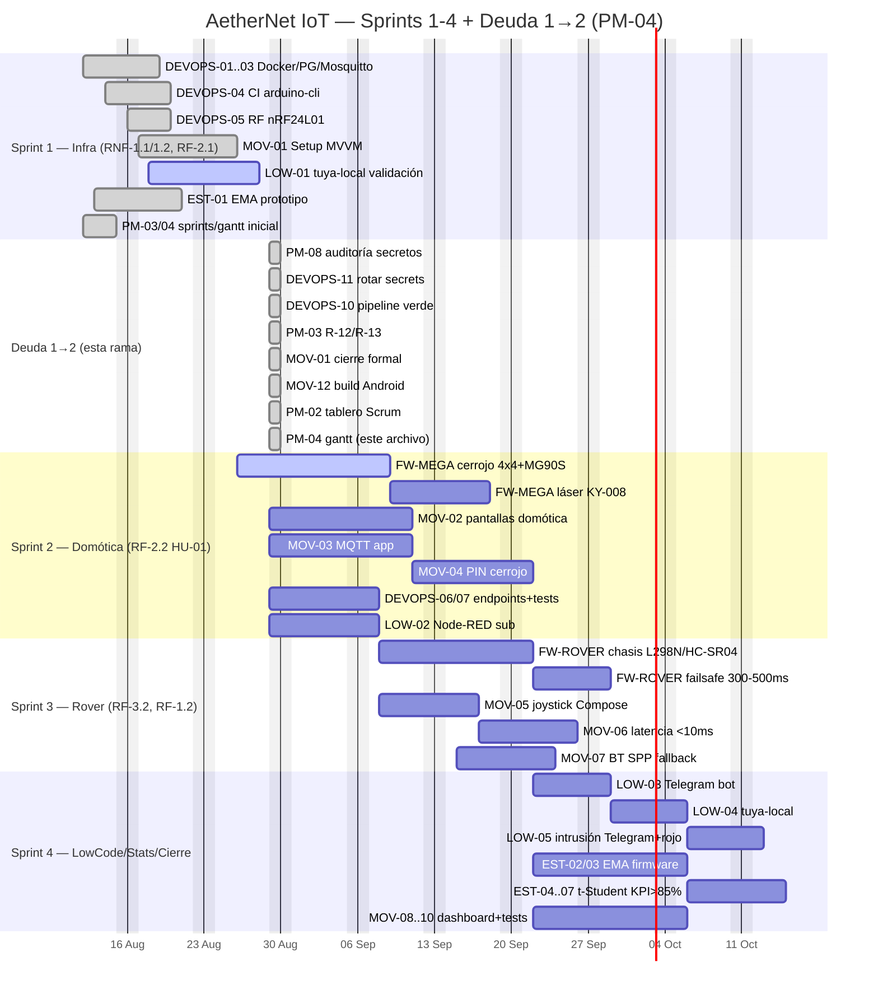

# Diagrama Gantt — AetherNet IoT (PM-04)

Resuelve deuda Sprint 1→2 PM-04. Fuente: `docs/sprints.md:9-48` + `docs/backlog.md:9-79` + `docs/branching-strategy.md:122-131` + `docs/deuda-sprint1-sprint2.md`.

> Sprint 1 fechado 2026-08-26 (merge `9eac686` a `develop`), Sprint 2 activo. Deuda 1→2 saldada 2026-08-29 en `feature/firmware-mega-cerrojo`. Fuera de alcance (W) omitido.



## Dependencias críticas (flechas lógicas)

```
DEVOPS-01..05 (Sprint 1) ─┬─► Sprint 2 (FW-MEGA/MOV-02..04/LOW-02) ─┬─► Sprint 4 (LOW-03..05, EST)
                          │                                        │
EST-01 ───────────────────┘                                        ├─► Sprint 3 (MOV-05/06 joystick) ─┘
PM-08 ─► DEVOPS-11 ─► DEVOPS-10 ─► MOV-01/12 (deuda, ya saldada 2026-08-29)
```

- **Ruta crítica:** `DEVOPS-11 → DEVOPS-10 → MOV-01` (desbloqueó CI y KSP 1.9.22-1.0.17, `.gitignore`).
- **Riesgo LOW-01** (`R-01`) validado en Sprint 1, no esperar a Sprint 4 (`backlog.md:63`).
- `MOV-06` latencia joystick depende de `DEVOPS-05` RF ya probado.

## Hitos

- 2026-08-26 Sprint 1 merge `9eac686` → `develop` + `sprint/2-domotica-acceso` activo.
- **2026-08-29 Deuda 1→2 saldada** (8/8 ACT en `docs/deuda-sprint1-sprint2.md`).
- 2026-09-08 Sprint 3 inicia (requiere Sprint 2 verde).
- 2026-09-22 Sprint 4 cierre E2E + sustentación.

## Export

Mermaid renderizable en GitHub/docs o `presentaciones/gantt.pptx` (usar `docs/gantt.md` como fuente). No requiere dependencias propietarias (RNF-3.1 FOSS).
