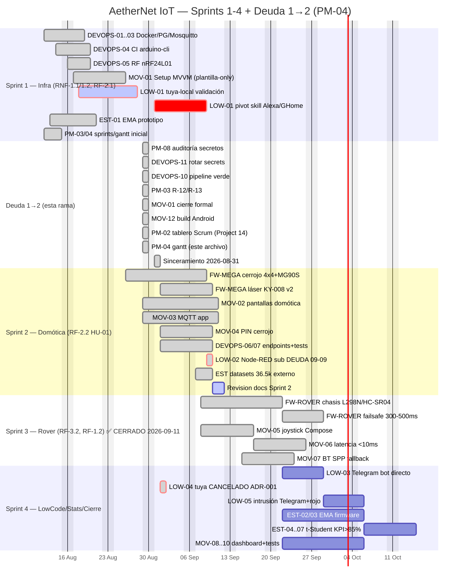

# Diagrama Gantt — AetherNet IoT (PM-04)

Resuelve deuda Sprint 1→2 PM-04. Fuente: `docs/sprints.md:9-48` + `docs/backlog.md:9-79` + `docs/branching-strategy.md:122-131` + `docs/deuda-sprint1-sprint2.md`.

> Sprint 1 fechado 2026-08-26 (merge `9eac686` a `develop`), Sprint 2 ✅ CERRADO 2026-09-10, **Sprint 3 ✅ CERRADO 2026-09-11**. Deuda 1→2 saldada 2026-08-29 en `feature/firmware-mega-cerrojo`, sincerada 2026-08-31 (MOV-01 plantilla-only, rotación cerrada, Project 14, LOW-01 pivot skill). **Actualizado 2026-09-11** `Sprint 3 Rover`: `MOV-05/06/07` Done + `FW-ROVER` chasis/evasion/anti-caída Done, `FW-MEGA cerrojo+laser` Done, `MOV-02/03/04` + `DEVOPS-06/07` Done, `LOW-02` deuda 2026-09-09, `LOW-04` cancelado, `EST-01` + datasets 36.5k adelantados. Sprint 4 activo. Fuera de alcance (W) omitido.



## Dependencias críticas (flechas lógicas)

```
DEVOPS-01..05 (Sprint 1) ─┬─► Sprint 2 (FW-MEGA/MOV-02..04/LOW-02) ─┬─► Sprint 4 (LOW-03..05, EST)
                          │                                        │
EST-01 ───────────────────┘                                        ├─► Sprint 3 (MOV-05/06 joystick) ─┘
PM-08 ─► DEVOPS-11 ─► DEVOPS-10 ─► MOV-01/12 (deuda, ya saldada 2026-08-29)
```

- **Ruta crítica:** `DEVOPS-11 → DEVOPS-10 → MOV-01` (desbloqueó CI y KSP 1.9.22-1.0.17, `.gitignore`).
- **Riesgo LOW-01** (`R-01`) **CANCELADO 2026-09-01** ADR-001 (no pivot skill — HU-02 solo LED+Telegram). **LOW-02** **DEUDA 2026-09-09** (no Node-RED esta iteración).
- `MOV-01` sincerado plantilla-only 2026-08-31 — lógica real queda para `feature/app-setup-mvvm` Sprint 2.
- `MOV-06` latencia joystick depende de `DEVOPS-05` RF ya probado.

## Hitos

- 2026-08-26 Sprint 1 merge `9eac686` → `develop` + `sprint/2-domotica-acceso` activo.
- **2026-08-29 Deuda 1→2 saldada** (8/8 ACT en `docs/deuda-sprint1-sprint2.md`).
- **2026-08-31 Sinceramiento:** MOV-01 plantilla-only (`docs/cierre-mov01.md:4`), rotación prod + AP lab `FELIPE./2516f751` (`R-12` Resuelto), Project `https://github.com/users/Craos6518/projects/14`, LOW-01 pivot skill Alexa/GHome (`R-01` alta bloqueada), `a051dd4` EMA bench en `develop`.
- 2026-09-07 FW-MEGA laser v2 `c7ce065` + DEVOPS-06/07 21 tests verdes.
- 2026-09-09 datasets 36.5k + admin doc `ec5d70b`.
- 2026-09-10 revisión `docs/revision-sprint2-completa` (esta rama) — sincroniza 9 docs.
- **2026-09-11 Sprint 3 ✅ CERRADO** — `MOV-05/06/07` + `FW-ROVER` (L298N/HC-SR04/TCRT5000, EMA α=0.2, failsafe 500ms, RF nRF24L01) — `rover-uno.ino:42/86/247/375` + `gateway-esp32.ino:241`.
- 2026-09-22 Sprint 4 cierre E2E + sustentación (activo).

## Export

Mermaid renderizable en GitHub/docs o `presentaciones/gantt.pptx` (usar `docs/gantt.md` como fuente). No requiere dependencias propietarias (RNF-3.1 FOSS).
